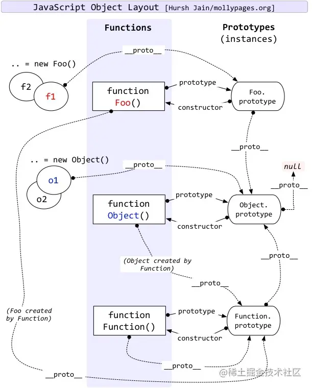
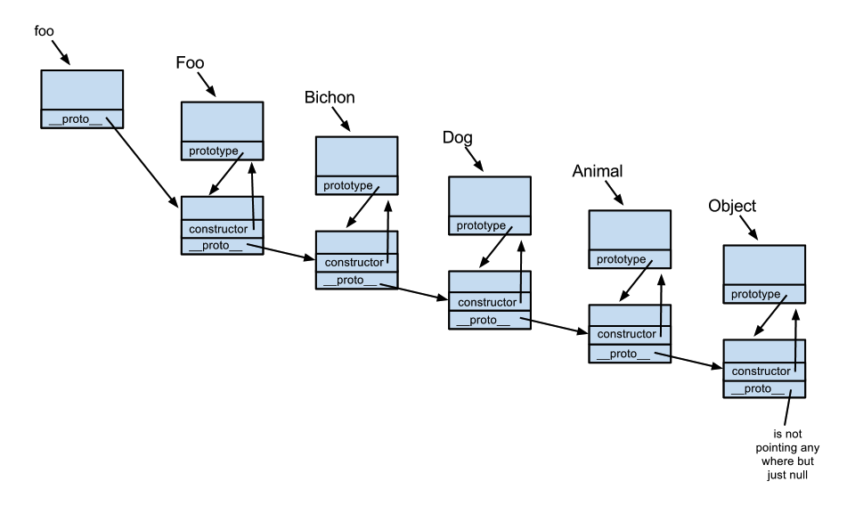

## JavaScript面向对象
###  一开始JavaScript没有类，那它是怎样实现继承的呢？
一开始设计者在设计JavaScript的时候并没有打算加入类的概念，他选择的是基于原型对象的面向对象系统。在原型编程的思想中，类不是必须的，一个对象是通过克隆另一个对象所得到的。

### 什么是原型：
每一个JavaScript对象(null除外)在通过构造函数创建一个对象的时候就会与之关联另一个对象（prototype）,prototype包含了这些对象的共同点，也就是我们所说的原型，每一个对象都会从原型"继承"属性。
### 为什么要使用原型？
原型对象的作用，是用来存放实例中共有的那部份属性、方法，可以大大减少内存消耗。
```
function changshaStuent(name,university){
  this.name = name;
  this.university = university;
}
changshaStuent.prototype.city = 'changsha';
let stuent1 = new changshaStuent('Amy','CSU')
let stuent2 = new changshaStuent('Bmy','HNU')
console.log(stuent1.city) // changsha
console.log(stuent2.city) // changsha

```
## prototype,__proto__,constructor
prototype是构造函数的属性，把要创建实例对象的共同点提取出来，组成一个prototype对象
__proto__是实例对象的属性，指向这个实例对象的构造函数的prototype
constructor是实例对象的属性，指向它的构造器
```
console.log(stuent1.__proto__)//{ city: 'changsha' }
console.log(changshaStuent.prototype)//{ city: 'changsha' }
console.log(stuent1.constructor)//[Function: changshaStuent]
```
三者关系可以参考下图：

## 原型链：由相互关联的原型组成的链状结构就是原型链。
实例对象可以通过__proto__属性找到它构造函数的原型，而构造函数也是它上一级实例函数创建出来的对象，通过这一特性，可以一直溯源下去找到每个构造函数的原型。这就是js的原型链继承。



